# Next Chapter — Mobile Development e IoT

**Toda peça merece um próximo capítulo.** Aplicativo acadêmico de compra, venda e troca de bolsas de luxo seminovas, desenvolvido para os Checkpoints 4 e 5 com **React Native, Expo e TypeScript**. O protótipo reúne dez telas, dados mockados, persistência local ou Supabase, testes e simulação no navegador Windows.

## Integrantes

| Nome | RM |
| --- | --- |
| Luan Orlandelli | 554747 |
| Jorge Luiz | 554418 |
| Arthur Bobadilla | 555056 |
| Albert Katri | 556544 |
| Bruno Biletsky | 554739 |
| Paulo Akira | 556840 |

## Proposta do aplicativo

Bolsas de luxo sem uso podem circular novamente, mas comprar ou vender uma peça seminova exige confiança, avaliação de conservação e informações claras. A Next Chapter reúne catálogo, venda assistida por curadoria e troca em uma experiência mobile.

O público-alvo são compradores interessados em luxo circular e proprietários que desejam vender ou renovar sua coleção. A proposta de valor combina informações sobre as peças, envio de fotos para avaliação e acompanhamento dos pedidos em um só aplicativo.

O modelo de negócio proposto é acesso gratuito ao catálogo, comissão sobre vendas concluídas e taxa administrativa nas trocas. Uma comissão inicial de 15% é uma hipótese a validar: uma venda de R$ 5.400 geraria R$ 810 de receita bruta antes dos custos. O diferencial proposto é combinar venda assistida, catálogo especializado e Exchange, com foco em bolsas de luxo seminovas. A viabilidade comercial ainda depende de pesquisa com compradores e vendedores.

**Pitch:** a Next Chapter transforma bolsas de luxo sem uso em novas histórias. Quem compra encontra peças com conservação informada; quem vende envia fotos e acompanha a curadoria; quem deseja renovar sua coleção solicita uma troca. O protótipo demonstra esses fluxos com dados fictícios e integração real com Supabase.

## Funcionalidades e navegação

| Tela | Funcionalidade |
| --- | --- |
| Splash | Identidade da marca e entrada pelo botão Começar |
| Home / Catálogo | Quatro bolsas com fotos, preços, busca por marca/modelo e navegação inferior |
| Detalhe do produto | Foto, descrição, estado, ano, tamanho, favorito e Comprar agora |
| Vender minha bolsa | Marca/modelo, conservação, seleção de 4 a 8 fotos e estimativa de venda |
| Exchange & Trade-in | Crédito disponível, peças elegíveis com fotos e acesso ao programa |
| Exchange Program | Histórico de solicitações e botão Realizar uma nova troca |
| Perfil / Meu capítulo | Saldo, favoritos, compras e cards rosas clicáveis de vendas e trocas |
| Checkout | Compra simulada, aplicação opcional de crédito e cálculo da diferença |
| Detalhe da peça enviada | Status, conservação, estimativa, código, data e galeria com miniaturas |
| Detalhe da troca | Foto ilustrativa, status, crédito estimado, código e data |

- **Compra:** Splash → Catálogo → Produto → Checkout → confirmação → Perfil.
- **Venda:** Catálogo → Vender → fotos e dados → enviar → Perfil → card da venda → galeria.
- **Troca:** Trade-in → Exchange Program → Realizar uma nova troca → selecionar peça → confirmar → histórico → detalhe.
- **Favoritos:** Produto → favoritar → Perfil. Os dados permanecem após recarregar no mesmo navegador e endereço.

O botão Voltar retorna à origem do fluxo, inclusive ao abrir detalhes pelo Perfil ou pelo histórico do programa.

### Dados e regras da demonstração

| Produto do catálogo | Preço fictício |
| --- | --- |
| Chanel Classic Flap | R$ 8.900 |
| Louis Vuitton Neverfull MM | R$ 5.400 |
| Dior Lady Dior | R$ 9.200 |
| Gucci Marmont Small | R$ 4.100 |

O saldo inicial fictício é R$ 1.240; as peças elegíveis são Louis Vuitton Speedy 30 e Michael Kors Selma, com estimativas de R$ 620 e R$ 310. Essas estimativas não aumentam automaticamente o saldo.

Venda exige marca/modelo com 3 a 120 caracteres e 4 a 8 fotos de até 6 MB cada. A estimativa-base para conservação Excelente é R$ 3.500–R$ 4.200; Novo aplica 115%, Bom 80% e Usado 60%. São cálculos demonstrativos, sem cotação real de mercado. Valores são armazenados em centavos.

A compra admite crédito parcial e nunca deixa saldo negativo. Pedidos são idempotentes para evitar duplicação. Uma peça não admite duas solicitações de troca. A solicitação recebe status **Solicitada**, sem conceder crédito automaticamente.

O protótipo não realiza pagamentos, frete, autenticação comercial das bolsas ou aprovação administrativa. A seção **Trocas realizadas** permanece vazia porque não há fluxo de conclusão nesta entrega. Preços, selos e peças são fictícios. Não há integração com dispositivo IoT; os requisitos fornecidos aceitam simulação no navegador.

## Identidade visual

Next Chapter representa o próximo capítulo de uma peça com outra pessoa. A tipografia implementada é **Inter**, nos pesos 400, 500, 700 e 900, empacotada no app. O logo em SVG foi reconstruído a partir das telas de referência. As seis telas do Figma orientaram a identidade; Perfil, Checkout e detalhes de venda/troca complementam os fluxos.

| Cor | Código | Aplicação |
| --- | --- | --- |
| Oliva | `#4B4D34` | Splash e cabeçalho |
| Rosa | `#E58DB3` | Botões e cards |
| Rosa claro | `#FFC5F1` | Símbolo da marca |
| Creme | `#F4E6DA` | Fundo das telas |
| Marrom | `#4B342B` | Texto e cabeçalhos |
| Areia | `#ACA077` | Elementos secundários |
| Rosa antigo | `#C67D97` | Trade-in |
| Verde | `#778653` | Selos e crédito |
| Rosa escuro | `#C6537D` | Preços |
| Branco | `#FFFFFF` | Fotos e campos |

## Links da apresentação

- [Repositório público no GitHub](https://github.com/LuanOrlandelli/cp5-next-chapter-mobile).
- [Vídeo de demonstração no Google Drive](https://drive.google.com/file/d/1G6LfKHhAdkCW3e-8JkhPuDJJDvbkFPOv/view?usp=sharing).
- [Protótipo no Figma](https://www.figma.com/design/JpMUPu4txwKTUpDvjHxelR/Next-Chapter-%E2%80%94-App-Prototype?node-id=0-1&t=NfwugDCNd9QBRdyS-1).

O grupo confirmou em 04/10/2026 que vídeo e Figma abrem em janela anônima. O repositório está público.

## Executar o projeto

Pré-requisito: **Node.js 24 LTS com npm**. Na pasta do projeto:

```bash
npm ci
npm run web
```

Abra **http://localhost:8081**. O navegador exibe uma coluna mobile de até 390 px. Se a porta estiver ocupada, encerre o servidor anterior do projeto antes de reiniciar.

Sem variáveis Supabase, o app usa catálogo JSON e AsyncStorage. Use o mesmo navegador, host e porta para manter o histórico: outra porta ou janela anônima pode iniciar outra sessão. `npm run web -- --clear` limpa o cache do Expo, sem apagar os dados do navegador. Reinicie o Expo após alterar `.env`.

Para emulador Android: iniciar um AVD no Android Studio e executar `npm run android`. Para Expo Go compatível com SDK 57: executar `npm start` e ler o QR Code, com celular e computador na mesma rede. A simulação comprovada nesta entrega foi feita no navegador Windows.

## Integração com Supabase

1. Criar um projeto de demonstração no Supabase.
2. Executar [schema.sql](supabase/schema.sql) e depois [seed.sql](supabase/seed.sql) no SQL Editor.
3. Habilitar **Anonymous Sign-Ins** em Authentication.
4. Copiar [.env.example](.env.example) para `.env` e preencher:

```env
EXPO_PUBLIC_SUPABASE_URL=https://SEU-PROJETO.supabase.co
EXPO_PUBLIC_SUPABASE_ANON_KEY=SUA_CHAVE_PUBLICA_ANON_OU_PUBLISHABLE
```

5. Reiniciar o Expo, abrir Perfil e verificar **Dados: Supabase**.
6. Executar `npm run test:supabase` para verificar a integração real.

O `.env` não é versionado. Use apenas URL e chave pública no cliente; senha do banco e chave `service_role` não entram no aplicativo. Configuração parcial ou falha remota apresenta erro, sem mudar silenciosamente para dados locais.

| Tabela | Dados |
| --- | --- |
| `products` | Catálogo fictício |
| `wallets` | Crédito por usuário |
| `eligible_pieces` | Peças elegíveis |
| `favorites` | Produtos favoritos |
| `sales` | Curadorias, estimativas e caminhos das fotos |
| `orders` | Compras simuladas |
| `exchanges` | Solicitações de troca |

A sessão anônima identifica cada usuário, e políticas **RLS** isolam seus registros. `initialize_demo` cria o saldo uma única vez; `place_demo_order` calcula a compra e atualiza a carteira em transação; `request_demo_exchange` valida a peça e impede duplicatas. O banco recalcula a estimativa de venda por trigger.

As fotos do catálogo são assets locais associados aos IDs. As fotos enviadas pelo usuário ficam no bucket privado **sale-photos**, em pastas por usuário/envio; a galeria usa URLs assinadas de uma hora. Perder a sessão anônima não apaga a venda do banco, mas impede acessar seu histórico nessa nova sessão. Cadastro e recuperação de conta são evoluções futuras.

## Arquitetura e bibliotecas

React Native + Expo SDK 57 + TypeScript compartilham a interface com o navegador por React Native Web. `App.tsx` controla uma pilha simples de navegação e o estado; componentes, telas, regras e persistência ficam separados. A navegação não sincroniza a URL nem implementa deep links.

```text
App.tsx                    Navegação e estado
src/screens/               Dez telas
src/components/            Componentes reutilizáveis e marca
src/theme.ts               Cores e tipografia
src/data/                  Catálogo JSON e mapeamento de fotos
src/domain/rules.ts        Regras de negócio
src/services/              Persistência local e Supabase
supabase/                  Schema, funções, RLS e seed
tests/                     Testes de domínio, banco e interface
scripts/                   Verificação remota e evidências
assets/evidencias/         Prints da apresentação
docs/evidence/             Evidências automatizadas
```

| Biblioteca | Finalidade |
| --- | --- |
| React Native Web / React DOM | Execução no navegador |
| Expo ImagePicker | Seleção de fotos |
| AsyncStorage | Dados locais e sessão persistente |
| Supabase JS | Banco, autenticação anônima e Storage |
| React Native SVG | Logo e ícone de troca |
| Expo Font / Inter | Tipografia empacotada |
| Safe Area Context | Áreas seguras do aparelho |
| tsx / node:test | Testes de regras |
| PGlite | Testes SQL em PostgreSQL embarcado |
| Playwright | Testes de interface, prints e vídeos |

## Testes e validação

```bash
npm run typecheck
npm test
npm run test:db
npx playwright install chromium
npm run test:e2e
npm run evidence
npm run test:supabase
npm run build:web
```

| Verificação registrada em 02–04/10/2026 | Resultado |
| --- | --- |
| TypeScript | Aprovado |
| Regras de negócio | 12 testes aprovados |
| SQL, funções e RLS | 9 subcenários aprovados |
| Interface Chromium | 6 testes aprovados; venda e troca reexecutadas após alterações |
| Expo Doctor | 21/21 verificações aprovadas |
| Exportação web | Build gerado |
| Supabase real | Catálogo, carteira, favoritos, fotos privadas, venda, compra, troca e isolamento verificados |

Os testes de interface usam dados locais e porta isolada, normalmente 8082, configurável por `E2E_PORT`. Os testes SQL usam estruturas mínimas de Auth/Storage; a conexão remota foi verificada separadamente. `test:supabase` cria duas sessões e registros fictícios em um projeto de teste, que permanecem no banco.

Evidências: [galeria de testes com prints e vídeos](docs/evidence/index.html) e [resultado da integração Supabase](docs/evidence/12-supabase-integration.txt). A validação foi realizada no Windows/Chromium; Android e iOS não são declarados como testados.

### Roteiro manual de apresentação e teste

| Ação | Resultado esperado |
| --- | --- |
| Começar, buscar marca e abrir produto | Catálogo, filtro e detalhes coerentes |
| Favoritar e recarregar | Favorito permanece no Perfil |
| Enviar venda sem dados ou com menos de 4 fotos | Validação bloqueia envio |
| Preencher venda, escolher conservação e enviar 4 fotos | Estimativa e card persistido no Perfil |
| Abrir card de venda e selecionar miniaturas | Fotos e informações correspondentes |
| Solicitar troca e abrir card pelo programa/Perfil | Histórico, detalhes e retorno à origem |
| Solicitar novamente a mesma peça | Duplicata bloqueada |
| Comprar Chanel usando R$ 1.240 de crédito | Diferença R$ 7.660; saldo zero e pedido persistido |
| Comprar sem crédito | Preço integral; saldo preservado |
| Recarregar no mesmo endereço e navegador | Histórico permanece |
| Conferir tabelas e Storage | Registros e fotos persistidos |
| Usar duas sessões distintas | Dados privados isolados por usuário |

Para apresentar em 2–3 minutos: mostrar catálogo e produto, enviar uma venda com quatro fotos, abrir a galeria pelo Perfil, solicitar troca e abrir o histórico, demonstrar compra com crédito e recarregar. Finalizar com os registros no Supabase e evidências dos testes.

## Prints da versão final

Os 15 prints estão em `assets/evidencias/`. As capturas aparecem diretamente abaixo.

| Tela / evidência | Print |
| --- | --- |
| Splash | 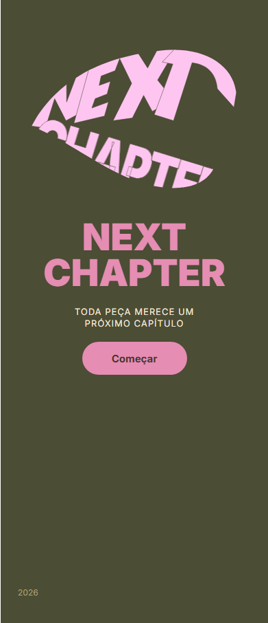 |
| Catálogo | 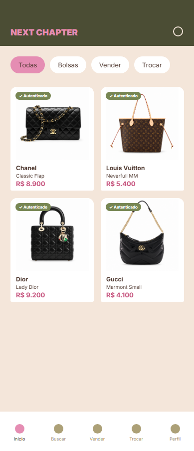 |
| Detalhe do produto | 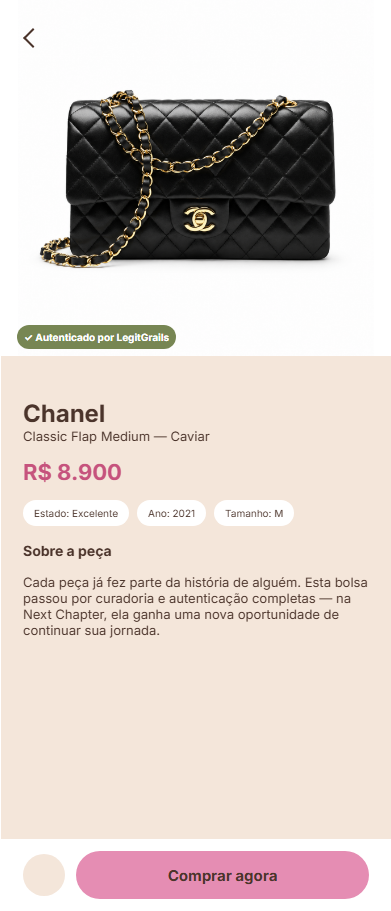 |
| Formulário de venda | 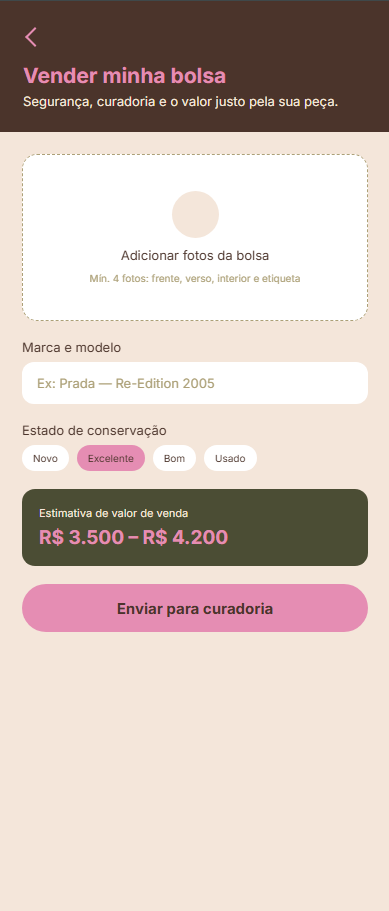 |
| Exchange & Trade-in | 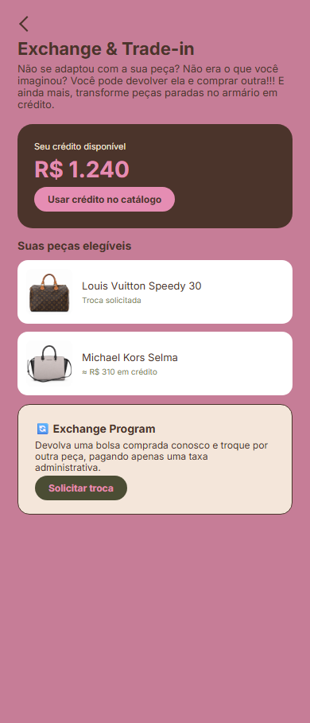 |
| Exchange Program | 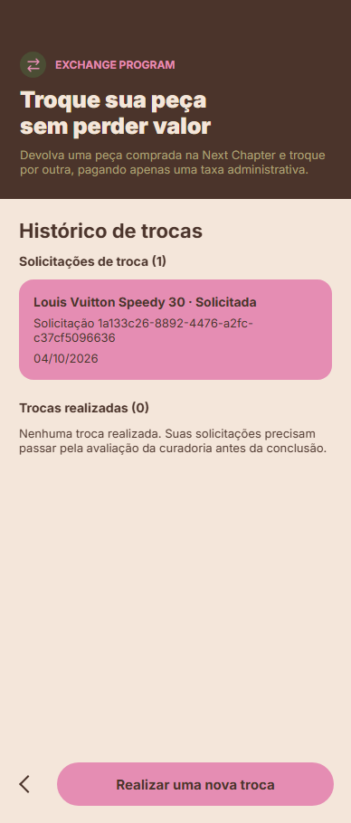 |
| Nova troca | 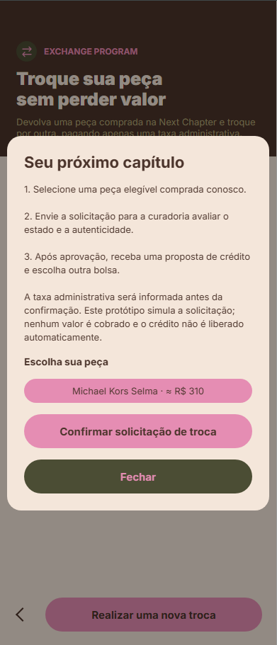 |
| Checkout | 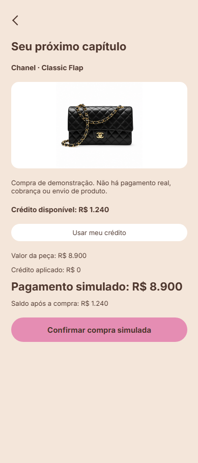 |
| Perfil | 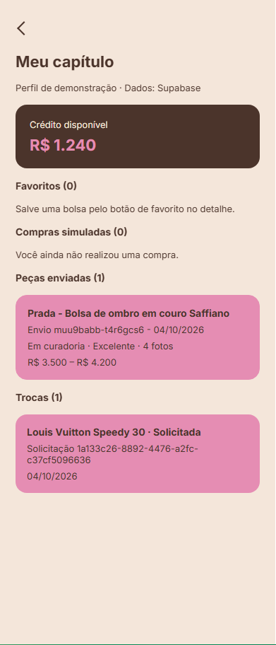 |
| Detalhe da venda | 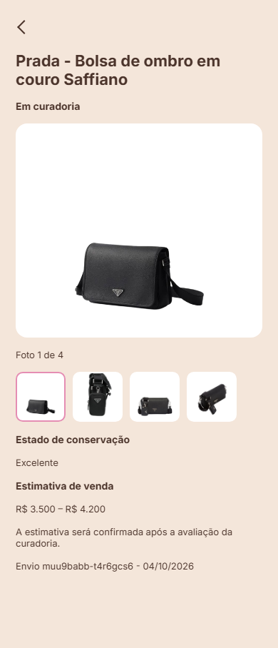 |
| Detalhe da troca | 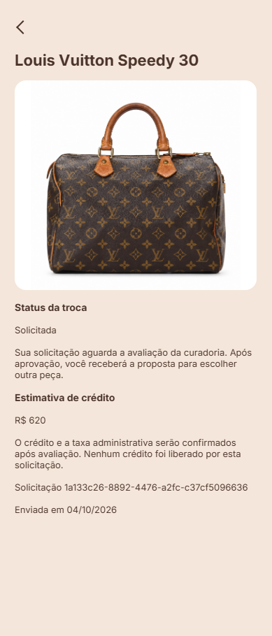 |
| Produtos no Supabase | 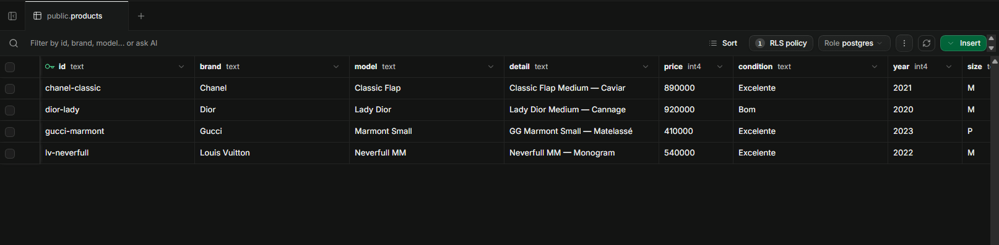 |
| Vendas no Supabase | 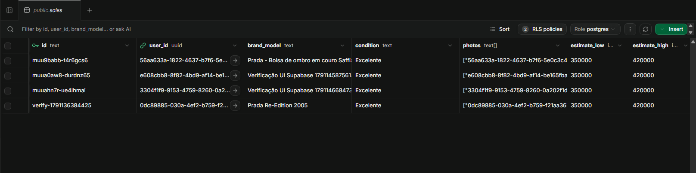 |
| Trocas no Supabase | 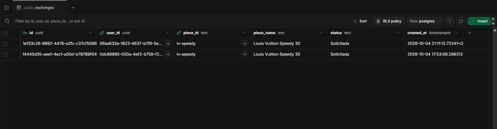 |
| Fotos no Storage | 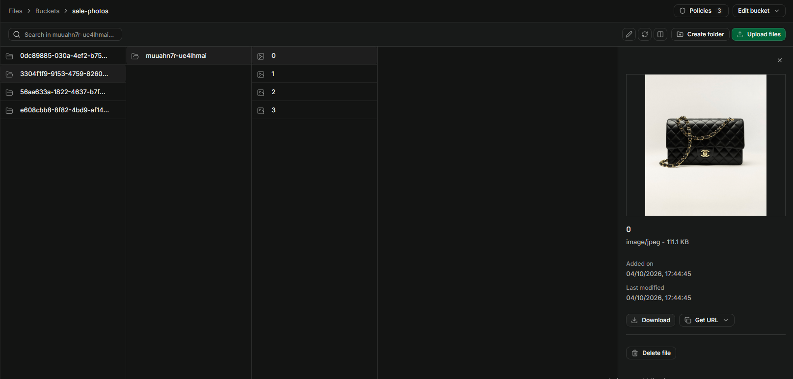 |

O formulário foi capturado antes do preenchimento e o checkout antes da compra, com crédito desativado. Os vídeos automatizados complementam esses prints. O Storage mostra quatro fotos de outro envio de teste; Perfil, detalhe de venda e tabela `sales` mostram a Prada apresentada.

## Fontes das fotos

As seis fotos são ilustrativas, empacotadas em `assets/products/`, sem links externos em tempo de execução. As versões `*-standard.png` foram editadas com IA para padronizar fundo branco, enquadramento e margens; os JPG originais foram preservados. As imagens não comprovam autenticidade ou conservação. Os direitos pertencem aos respectivos titulares; não há vínculo comercial com as marcas.

| Referência | Fonte |
| --- | --- |
| Chanel Classic | [CHANEL](https://www.chanel.com/us/fashion/p/A01112Y0129594305/classic-11-12-handbag-lambskin-gold-tone-metal/) |
| Louis Vuitton Neverfull MM | [Louis Vuitton](https://es.louisvuitton.com/esp-es/productos/bolso-neverfull-mm-monogram-nvprod5350101v/M46975) |
| Dior Lady Dior | [Dior](https://www.dior.com/en_us/fashion/products/M0565OGWH_M900) |
| Gucci Marmont Small | [Farfetch](https://www.farfetch.com/uk/shopping/women/gucci-small-gg-marmont-shoulder-bag-item-24099590.aspx) |
| Louis Vuitton Speedy 30 | [Fashionphile](https://www.fashionphile.com/products/louis-vuitton-monogram-speedy-30-571759) |
| Michael Kors Selma | [SPERA.de](https://www.spera.de), via [Wikimedia Commons](https://commons.wikimedia.org/wiki/File:Michael_Kors_Selma_LG_TZ_Satchel_Handtasche_30T3MLMS7T_Kalbsleder_schwarz_-_grau_black_-_pearl_grey_(1)_(16399888809).jpg), [CC BY 2.0](https://creativecommons.org/licenses/by/2.0/); fundo e enquadramento alterados com IA |

## Entrega CP4 e CP5

| Requisito | Local nesta entrega |
| --- | --- |
| Problema, público, proposta, pitch e negócio | Proposta do aplicativo |
| Marca, logo, cores e tipografia | Identidade visual, Splash e Figma |
| Repositório e estrutura inicial | GitHub público e arquitetura |
| Protótipo com dados mockados | Dez telas e fluxos de compra, venda e troca |
| Ambiente de teste | Comandos, resultados e roteiro manual |
| Documentação de navegação e decisões técnicas | Este README |
| Integração de banco | Supabase, SQL e evidências |
| Simulação no navegador | Prints, vídeo da apresentação e galeria de testes |

Toda a documentação de apresentação está concentrada neste README. Código, imagens, SQL, testes e evidências permanecem no repositório.
