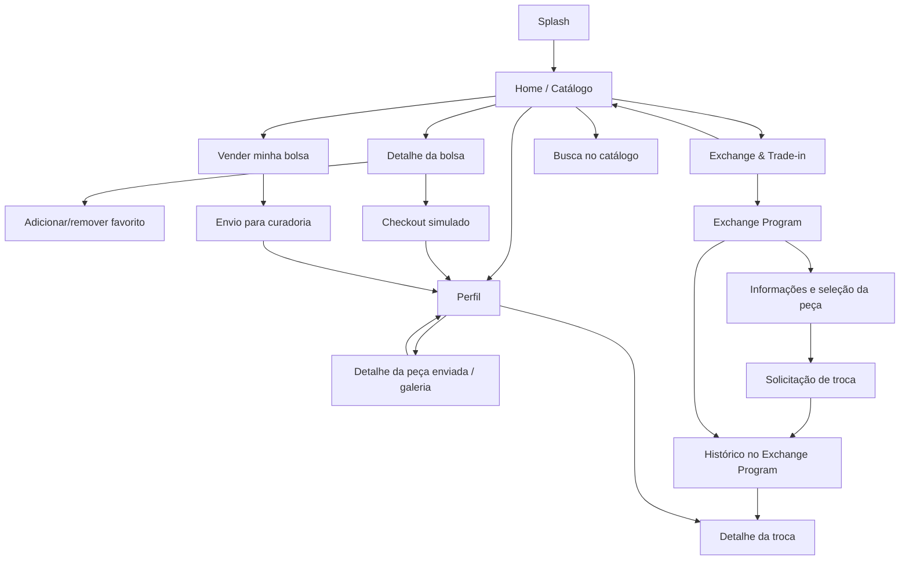

# Telas e navegação

| Tela | Entradas | Ações e resultado |
| --- | --- | --- |
| Splash | Inicialização | Começar abre catálogo |
| Home | Splash, retorno ou crédito | Todas/Bolsas selecionam filtro; Vender e Trocar abrem fluxos; cards abrem produto; Buscar abre campo; Perfil abre histórico |
| Detalhe | Card do catálogo/favorito | Voltar retorna à origem; círculo salva favorito; Comprar agora abre checkout |
| Vender | Aba ou botão Vender | Selecionar e remover fotos; preencher identificação; conservação altera estimativa; enviar valida, persiste e confirma |
| Trade-in | Aba ou botão Trocar | Exibe crédito; Usar crédito abre catálogo e preseleciona crédito no checkout; peça ou Solicitar troca abre programa |
| Exchange Program | Trade-in | Mostra histórico de solicitações e seção de trocas realizadas; Realizar uma nova troca ou header abre explicação e seleção; confirmar registra solicitação; card abre detalhes |
| Checkout | Detalhe | Liga/desliga uso do crédito; mostra valor, desconto e saldo; confirma pedido e abre Perfil |
| Perfil | Navegação ou compra | Mostra favoritos, saldo, pedidos e cards rosas de peças enviadas e trocas; favorito abre produto; card abre detalhes |
| Detalhe de peça enviada | Card no Perfil | Foto ampliada e miniaturas selecionáveis; estado, status, estimativa, código e data; Voltar retorna ao Perfil |
| Detalhe da troca | Card no Perfil ou Exchange Program | Foto ilustrativa da peça, status, estimativa de crédito, código e data; Voltar retorna à origem |

## Estados e retorno
- Carregamento: indicador durante consulta inicial.
- Catálogo vazio por busca: mensagem e possibilidade de alterar a busca.
- Erro de dados: mensagem e Tentar novamente. Uma falha no Supabase não muda silenciosamente para dados locais.
- Operação em andamento: botão desabilitado e trava contra duplo envio.
- Formulário inválido: mensagem junto ao botão; não persiste.
- Operação concluída: diálogo de confirmação e histórico atualizado.
- Botão Voltar usa uma pilha de telas; hardware Back do Android usa a mesma pilha.
- Recarregar inicia na Splash; os dados permanecem armazenados na mesma sessão e origem do navegador.
- Galeria de venda: indicador durante consulta; erro com Carregar fotos novamente; links privados renovados ao reabrir ou tentar novamente.
- Histórico vazio: mensagens para ausência de solicitações e de trocas realizadas.

Todas e Bolsas exibem o mesmo catálogo nesta entrega porque as quatro peças pertencem à categoria Bolsas. O catálogo, o detalhe e o checkout usam fotos ilustrativas locais dos quatro produtos; o fluxo de venda aceita fotos da galeria.
### Detalhe de uma peça enviada

Perfil → Peças enviadas → tocar em qualquer parte do card rosa → detalhes da curadoria. A tela mostra foto ampliada, miniaturas selecionáveis, estado, status, estimativa, data e código do envio. Voltar retorna ao Perfil. Em caso de falha nas fotos, é possível tentar novamente. A confirmação do envio informa o código e se a peça foi salva no Supabase ou no navegador.

### Histórico de trocas

Perfil ou Exchange Program → card rosa de troca → detalhes com foto da peça, status, estimativa de crédito, data e código. Voltar retorna à tela de origem. Realizar uma nova troca abre a seleção de peças elegíveis. Uma peça que já possui solicitação não aparece novamente entre as opções.

O protótipo registra solicitações; a conclusão pela curadoria não é automática nem está implementada. Por isso, a seção de trocas realizadas fica vazia enquanto não houver registros concluídos. Fotos das peças elegíveis são ilustrativas e locais.

### Sessão e privacidade

Use `http://localhost:8081` no mesmo navegador. Mudar host, porta ou janela anônima pode abrir outra sessão e outro histórico; isso não exclui os registros anteriores. A autenticação anônima do Supabase identifica o proprietário de cada venda, pedido e troca. As peças enviadas à curadoria não entram automaticamente no catálogo público e não aparecem no Perfil de outro usuário.
