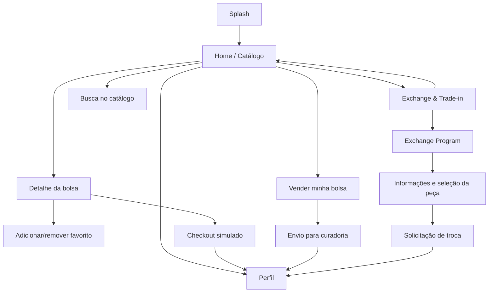

# Telas e navegação

| Tela | Entradas | Ações e resultado |
| --- | --- | --- |
| Splash | Inicialização | Começar abre catálogo |
| Home | Splash, retorno ou crédito | Todas/Bolsas selecionam filtro; Vender e Trocar abrem fluxos; cards abrem produto; Buscar abre campo; Perfil abre histórico |
| Detalhe | Card do catálogo/favorito | Voltar retorna à origem; círculo salva favorito; Comprar agora abre checkout |
| Vender | Aba ou botão Vender | Selecionar e remover fotos; preencher identificação; conservação altera estimativa; enviar valida, persiste e confirma |
| Trade-in | Aba ou botão Trocar | Exibe crédito; Usar crédito abre catálogo e preseleciona crédito no checkout; peça ou Solicitar troca abre programa |
| Exchange Program | Trade-in | Conhecer o programa ou header abre explicação e seleção; confirmar registra uma troca; Voltar retorna |
| Checkout | Detalhe | Liga/desliga uso do crédito; mostra valor, desconto e saldo; confirma pedido e abre Perfil |
| Perfil | Navegação ou compra | Mostra favoritos, saldo, pedidos, curadorias e trocas; favorito abre detalhe |

## Estados e retorno
- Carregamento: indicador durante consulta inicial.
- Catálogo vazio por busca: mensagem e possibilidade de alterar a busca.
- Erro de dados: mensagem e Tentar novamente. Uma falha no Supabase não muda silenciosamente para dados locais.
- Operação em andamento: botão desabilitado e trava contra duplo envio.
- Formulário inválido: mensagem junto ao botão; não persiste.
- Operação concluída: diálogo de confirmação e histórico atualizado.
- Botão Voltar usa uma pilha de telas; hardware Back do Android usa a mesma pilha.
- Recarregar inicia na Splash; os dados permanecem armazenados.

Todas e Bolsas exibem o mesmo catálogo nesta entrega porque as quatro peças pertencem à categoria Bolsas. Os blocos areia são placeholders deliberados das referências; fotos reais são selecionadas apenas no fluxo de venda.